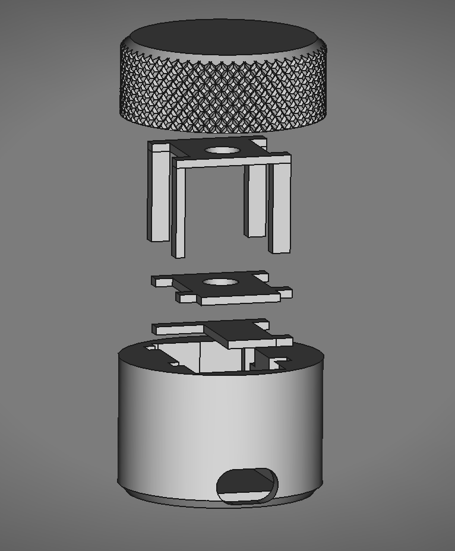

# Volume Knob

Project remix of the [Prusa oversized volume knob](https://blog.prusa3d.com/3d-print-an-oversized-media-control-volume-knob-arduino-basics_30184/).

## Bill of material

- Arduino Pro Micro (USB-C or Micro-USB)
   
- USB cable
- Rotary encoder with button (KY-040)
   

- 5 wires (25mm long)

## Instructions

### Wiring

Remove headers from both Arduino and rotary encoder and solder wires directly to contacts on PCB.

### 3D printing settings

|              |            |
| ------------ | ---------- |
| Printer      | Ender 3 S1 |
| Layer height | 0.2mm      |
